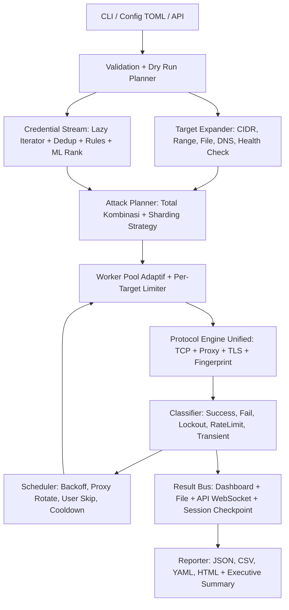

# PLAN1 - Full Upgrade dan Deep Improvement Veltrix

**Versi:** 1.0
**Tanggal:** 2026-09-21
**Status:** Draft untuk eksekusi
**Target rilis:** Veltrix v2.0
**Prinsip utama:** authorized testing only, aman, cepat, akurat, mudah dioperasikan

---

## 1. Ringkasan Eksekutif

Veltrix saat ini sudah kuat sebagai single binary Rust dengan 47 modul protokol, worker pool async, scanner, proxy, output multi format, dan ML helper. Tapi masih ada fondasi yang bolong dan potensi power yang belum keluar.

Plan1 ini bertujuan menaikkan Veltrix dari "brute forcer cepat" menjadi "security auditing platform" yang:

1. Mampu handle wordlist 100M+ tanpa OOM lewat true streaming
2. Akurat, minim false positive, sadar lockout dan rate limit
3. Penuh terhubung: scan, fingerprint, attack, report dalam satu alur
4. Siap tim: API aman, Web UI real time, distributed mode real
5. Mudah maintain: CLI rapi, config konsisten, test coverage tinggi

Non-goals v2.0:
- Tidak menambah 20 protokol baru sebelum 47 yang ada distabilkan
- Tidak membuat fitur evasif untuk penyalahgunaan, semua kontrol stealth untuk audit resmi dengan izin tertulis
- Tidak mengganti runtime dari Tokio

---

## 2. Baseline Saat Ini

### 2.1 Yang sudah bagus, dipertahankan

- Trait `Protocol::authenticate()` + registry di `src/protocols/mod.rs`
- `AttackOrchestrator` di `src/core/attack.rs` sekitar 693 baris, alur jelas
- `WorkerPool` dengan `Semaphore + JoinSet + mpsc`
- `patterns.rs` untuk klasifikasi error
- `ratelimit.rs` token bucket + jitter
- Output plain, json, csv, html, yaml + `report.rs`
- Enkripsi AES-256-GCM + Argon2 di `utils/encrypt.rs`
- Scanner dengan banner grabber dan service DB
- Struktur `core`, `protocols`, `proxy`, `scanner`, `api`, `distributed`, `utils` sudah modular

### 2.2 Masalah yang harus diperbaiki dulu

| ID | Masalah | Dampak |
|---|---|---|
| B01 | Credential di-load semua ke `Vec<Credential>`, belum streaming | OOM untuk wordlist besar |
| B02 | `build_attack_config` hardcode `resume_file=None, config_file=None, single_user=false, spray=false, rule_file=None, distributed=None, api_bind=None` | Fitur mati padahal struct sudah ada |
| B03 | Proxy chain hanya pakai proxy pertama untuk `reqwest` | HTTP path tidak benar-benar chain |
| B04 | Beberapa protokol bypass proxy atau TLS tidak konsisten | Hasil tidak konsisten di lab proxy |
| B05 | API server manual tanpa auth dan tanpa TLS, POST attack blocking | Tidak aman dibuka ke network |
| B06 | Scanner dan attack belum terhubung otomatis | Operator kerja manual 2 tahap |
| B07 | Resume session belum di-wire penuh ke CLI baru | Attack panjang susah dilanjutkan |
| B08 | Versi ganda: `Cargo.toml 1.0.0` vs `cli 1.2.0` vs banner v1.2 | Membingungkan rilis |
| B09 | `README.md` sebelumnya minimal, `PRD.md` matriks 8 protokol sudah usang | Onboarding sulit |
| B10 | File stray `kali.py, pass.txt, user.txt` di root | Risiko kredensial bocor, repo kotor |

---

## 3. Target Keberhasilan v2.0

### 3.1 Metrik kuantitatif

- [ ] 10M kombinasi user x password jalan tanpa OOM, memori stabil di bawah 500 MB
- [ ] 50k kombinasi di lab lokal selesai dengan throughput terukur dan reproducible via `cargo bench`
- [ ] False positive rate mendekati 0% di docker test matrix untuk ssh, ftp, mysql, http, smb, rdp
- [ ] Resume 100% akurat: stop di tengah, lanjut, tidak ada duplikat testing
- [ ] `cargo test` + `cargo clippy -D warnings` + `cargo fmt --check` hijau di CI
- [ ] 200+ unit test lolos, termasuk parser target, credential, rules, proxy, patterns, ratelimit

### 3.2 Metrik kualitatif

- [ ] `veltrix --help` dan `veltrix man` selalu sinkron dengan kode
- [ ] Satu config TOML bisa mereproduksi satu attack penuh
- [ ] Operator baru bisa scan lalu attack dalam 5 menit hanya baca README
- [ ] Semua output sensitif mudah dienkripsi dan mudah dihapus setelah engagement

---

## 4. Arsitektur Target v2.0

### 4.1 Diagram alur baru

### 4.2 Perubahan struktur kode yang direncanakan

- `src/core/credential_stream.rs` baru: lazy iterator + `memmap2` + Bloom/DashSet dedup
- `src/core/planner.rs` baru: hitung total, dry run, sharding untuk distributed
- `src/core/limiter.rs` refactor dari `ratelimit.rs`: global + per-target + per-user limiter
- `src/core/scheduler.rs` baru: pindah logika backoff dan skip dari `worker.rs`
- `src/core/session.rs` refactor dari `utils/resume.rs`: atomic checkpoint + resume exact
- `src/protocols/transport.rs` baru: semua protokol wajib lewat helper TCP, proxy, TLS yang sama
- `src/api/` migrasi ke framework `axum` + auth + job queue
- `src/auto/` baru: scan to attack orchestrator

Tidak ada rewrite total. Refactor bertahap per modul dengan test menjaga perilaku lama.

---

## 5. Rencana Fase

## FASE 0 - Baseline, Kebersihan, dan Test Harness

**Tujuan:** repo bersih, versi tunggal, CI hijau, lab reproducible.

**Task:**

- [ ] 0.1 Hapus atau karantina `kali.py, pass.txt, user.txt` dari root, masukkan ke `.gitignore` untuk data sensitif
- [ ] 0.2 Samakan versi: tentukan single source of truth, misal `Cargo.toml`, lalu `cli.rs` baca dari `env!("CARGO_PKG_VERSION")`
- [ ] 0.3 Rapikan `.gitignore`: `target/, target.old/, *.enc, *.log, wordlists/custom*, session*.json`
- [ ] 0.4 Kunci toolchain di `rust-toolchain.toml` dan update `Dockerfile` builder ke versi yang sama
- [ ] 0.5 Tambah GitHub Actions: `cargo test`, `clippy`, `fmt --check`, `cargo build --release`
- [ ] 0.6 Stabilkan `docker/docker-compose.test.yml` sebagai matrix test: ssh, ftp, mysql, telnet, smtp, http, smb, rdp mock
- [ ] 0.7 Tambah `scripts/smoke.sh`: 10 skenario cepat + cek exit code 0 dan 1
- [ ] 0.8 Tambah `cargo bench` baseline untuk target parse, credential expand, classify, report render

**File sentuh:** `Cargo.toml, src/cli.rs, Dockerfile, .github/workflows/, docker/, scripts/, .gitignore`

**Acceptance:**
- CI hijau
- Smoke test bisa jalan di mesin fresh dengan Docker
- Tidak ada file kredensial contoh yang berisiko di root

---

## FASE 1 - Core Engine Streaming dan Adaptif

**Tujuan:** handle wordlist raksasa tanpa OOM, throughput naik, kontrol overload.

**Task:**

- [ ] 1.1 Buat `CredentialStream` lazy: `users x passwords` tidak diexpand di awal, pakai iterator + batch pull 256/1024
- [ ] 1.2 Implementasi wordlist `mmap` streaming dengan batas memori dan prefetch
- [ ] 1.3 Dedup hemat memori: `FxHashSet` untuk kecil, `DashSet` sharded untuk besar, opsi Bloom filter untuk 100M+
- [ ] 1.4 Ganti `total = targets * creds` dengan `planner` yang support unknown total + progress adaptif
- [ ] 1.5 Worker pool adaptif: naikkan thread saat success rate stabil dan latency rendah, turunkan saat timeout naik
- [ ] 1.6 Pisahkan I/O bound vs CPU bound: `spawn_blocking` khusus untuk `ssh2` dan parser berat
- [ ] 1.7 Tambah metric internal: attempts per sec EMA, p50/p95 latency, timeout ratio, retry ratio
- [ ] 1.8 Tambah `--dry-run`: tampilkan jumlah target, credential, total kombinasi, estimasi waktu, lalu exit

**File sentuh:** `src/core/attack.rs, src/core/worker.rs, src/core/credential.rs, src/core/wordlist.rs, src/utils/parallel.rs, src/utils/mem_load.rs`

**Acceptance:**
- 1M password file jalan dengan memori flat
- `--dry-run` akurat untuk cartesian dan combo
- Bench sebelum vs sesudah terdokumentasi di `docs/bench-v2.md`

---

## FASE 2 - CLI dan Config Wiring

**Tujuan:** semua fitur yang sudah ada bisa dipakai user, tidak ada flag mati.

**Task:**

- [ ] 2.1 Kembalikan flag hilang: `--spray, --single-user, --resume, --config, --rule, --max-mutations, --checkpoint, --distributed, --api-bind`
- [ ] 2.2 Samakan TOML dan JSON loader: satu `Config::merge()` dengan prioritas `CLI > TOML/JSON > default`
- [ ] 2.3 Tambah validasi silang: misal `--spray` butuh user file besar + password sedikit, beri warning jika pola berisiko lockout
- [ ] 2.4 Tambah `veltrix validate --config veltrix.toml`: cek file, wordlist path, proxy path, rule path
- [ ] 2.5 Sinkronkan `print_manual()` dengan clap: generate manual dari definisi CLI agar tidak drift
- [ ] 2.6 Tambah shell completion: `veltrix completion bash|zsh|fish|powershell`
- [ ] 2.7 Standardisasi exit code dan pesan error: `0 sukses ada temuan, 1 tidak ada temuan atau gagal, 2 config invalid, 130 interrupted`

**File sentuh:** `src/cli.rs, src/core/config.rs, src/core/config_loader.rs, src/core/config_toml.rs, src/main.rs`

**Acceptance:**
- Semua field `AttackConfig` bisa diisi dari CLI atau config file
- `validate` gagal dengan pesan jelas untuk path tidak ada dan format salah
- Test integrasi CLI untuk tiap flag baru

---

## FASE 3 - Transport Unifikasi dan Hardening Protokol

**Tujuan:** 47 protokol konsisten, akurat, dan proxy aware.

**Task:**

- [ ] 3.1 Buat `protocols/transport.rs`: `connect_tcp()`, `connect_via_proxy()`, `upgrade_tls()`, `with_timeout()`, keepalive standar
- [ ] 3.2 Migrasi bertahap 47 modul ke transport helper, mulai dari ssh, ftp, smtp, mysql, http, smb, rdp, postgres
- [ ] 3.3 Perbaiki proxy untuk `reqwest` path: dukung chain beneran atau dokumentasikan batasan dengan jelas + warning runtime
- [ ] 3.4 Tambah fingerprint dan validator per protokol: contoh HTTP cek status + body marker + redirect, SMB cek NTSTATUS, SSH cek banner dan auth reply
- [ ] 3.5 Tambah `--fp-check` mode: hanya verifikasi ulang credential yang diklaim sukses untuk eliminasi false positive
- [ ] 3.6 Tambah test matrix per protokol dengan Docker mock + fixture respons sukses dan gagal
- [ ] 3.7 Dokumentasikan tabel port default, TLS mode, dan keterbatasan di README dan `man`

**File sentuh:** `src/protocols/*, src/proxy/mod.rs, src/core/engine.rs, src/utils/patterns.rs`

**Acceptance:**
- Semua protokol lewat helper koneksi yang sama
- Tidak ada bypass proxy diam-diam
- Test per protokol hijau, false positive 0 di lab

---

## FASE 4 - Stealth, Rate Limit, dan Anti Lockout

**Tujuan:** aman dipakai di environment sensitif, minim lockout tidak sengaja.

**Task:**

- [ ] 4.1 Implementasi limiter 3 level: global, per-target, per-user
- [ ] 4.2 Implementasi mode spray first class: `--spray --spray-interval 30m --spray-jitter 20%`
- [ ] 4.3 Auto cooldown: jika terdeteksi lockout atau rate limit, pause user atau target terkait dengan backoff eksponensial
- [ ] 4.4 HTTP stealth pack: rotasi User-Agent, header order stabil, cookie jar benar, delay acak per request
- [ ] 4.5 Tambah `--safe-profile`: preset konservatif untuk production like: `threads 3, delay 1000ms, rate 5/s, retries 1, stop-on-first`
- [ ] 4.6 Tambah `--aggressive-lab` preset: hanya boleh jalan jika target RFC1918 atau flag `--i-understand-risk` diberikan
- [ ] 4.7 Dashboard warning: tampilkan estimasi lockout risk berdasarkan pola attempt

**File sentuh:** `src/utils/ratelimit.rs, src/core/scheduler.rs baru, src/core/worker.rs, src/protocols/http_auth.rs`

**Acceptance:**
- Spray 1 password ke 100 user tidak memicu lockout di lab lockout sensitive saat pakai safe profile
- Semua preset terdokumentasi dan teruji

---

## FASE 5 - Scanner ke Auto Attack

**Tujuan:** satu alur scan lalu attack, kurangi traffic sia-sia.

**Task:**

- [ ] 5.1 Perkaya `ServiceDb`: banner regex, versi, confidence score, mapping port ke protokol
- [ ] 5.2 Tambah `veltrix auto -t 10.0.0.0/24 --ports common`: output `open service -> attack plan`
- [ ] 5.3 Tambah `--only-open`: attack otomatis skip port yang closed di hasil scan terakhir
- [ ] 5.4 Satukan output scan + attack ke satu JSON dengan `scan_id` dan `attack_id`
- [ ] 5.5 Tambah policy file: contoh hanya boleh attack ssh dan ftp di subnet tertentu

**File sentuh:** `src/scanner/*, src/auto/ baru, src/cli.rs, src/utils/report.rs`

**Acceptance:**
- Auto mode di lab `/24` hanya attack service yang terbuka
- Ada test end to end scan lalu attack di Docker

---

## FASE 6 - Output, Report, API, dan Web UI

**Tujuan:** hasil mudah dibaca manusia dan mudah dimakan pipeline.

**Task:**

- [ ] 6.1 Standardisasi skema JSON v2: `run_id, started_at, finished_at, target, protocol, credential_ref, evidence, severity`
- [ ] 6.2 HTML report v2: ringkasan eksekutif, tabel temuan, rekomendasi remediasi, lampiran evidence terpotong aman
- [ ] 6.3 Redaksi otomatis: password penuh hanya tampil dengan flag `--show-secrets`, default tampil masked
- [ ] 6.4 Migrasi API ke `axum`: JWT, rate limit API, job queue non blocking, websocket progress
- [ ] 6.5 Web UI minimal: daftar job, detail job, live log, download report, stop job
- [ ] 6.6 Audit log: siapa submit job apa, kapan, ke target mana
- [ ] 6.7 Dokumentasikan `docs/api-v2.md` dengan contoh curl dan skema error

**File sentuh:** `src/api/*, src/utils/output.rs, src/utils/report.rs, web/ baru, docs/api-v2.md`

**Acceptance:**
- API tidak blocking untuk attack besar
- Tidak ada akses API tanpa token
- Report bisa dibuka auditor non teknis dan tetap berguna untuk engineer

---

## FASE 7 - Distributed Mode Real

**Tujuan:** skala horizontal untuk engagement besar.

**Task:**

- [ ] 7.1 Definisikan ulang protokol `veltrix-dist-v2`: tambah `version, run_id, chunk_id, checksum, resume_offset`
- [ ] 7.2 Coordinator: split deterministik by hash, retry chunk gagal, deduplicate result
- [ ] 7.3 Worker: heartbeat, pull batch, local checkpoint, graceful drain
- [ ] 7.4 Keamanan: mTLS atau WireGuard requirement + token per run + expiry
- [ ] 7.5 Observability: dashboard cluster, per node throughput, failed chunk list
- [ ] 7.6 Test chaos: matikan 1 worker di tengah jalan, pastikan tidak ada kombinasi hilang

**File sentuh:** `src/distributed/*, src/core/planner.rs, docs/distributed-v2.md`

**Acceptance:**
- 3 node menghasilkan hasil identik dengan 1 node untuk input sama
- Tidak ada duplikat dan tidak ada yang kelewat saat worker mati

---

## FASE 8 - Wordlist, Rules, dan ML Pipeline

**Tujuan:** fewer attempts, more hits.

**Task:**

- [ ] 8.1 Rule engine v2: operasi documented, `max_mutations` enforced, dry count akurat
- [ ] 8.2 Wordlist generator v2: profil target, perusahaan, musim, tahun, keyboard walk, leet level 1 sampai 3
- [ ] 8.3 ML ranker: skor kandidat sebelum dikirim, kirim yang paling probable dulu
- [ ] 8.4 Evaluasi: precision at K untuk ML di dataset uji, jangan klaim tanpa angka
- [ ] 8.5 Tambah perintah: `veltrix wordlist rank --input --model --top 10000 --output`

**File sentuh:** `src/core/rules.rs, src/utils/wordlist_gen.rs, src/utils/ml_predict.rs`

**Acceptance:**
- Rule expansion punya batas dan bisa di-dry-run
- ML ranking terbukti menaikkan hit rate awal di dataset uji

---

## FASE 9 - QA, Performance, Docs, dan Rilis v2.0

**Tujuan:** rilis bersih dan reproducible.

**Task:**

- [ ] 9.1 Naikkan coverage ke 200+ test, fokus ke parser, transport, classifier, limiter, resume
- [ ] 9.2 Fuzzing ringan untuk parser target, combo, HTTP response, dan banner
- [ ] 9.3 Bench resmi: single target, multi target, CIDR, 1M password, proxy on vs off
- [ ] 9.4 Security review: pastikan tidak ada `unsafe` baru, tidak ada shell exec, tidak ada secret logging
- [ ] 9.5 Final docs: README, `docs/usage.md`, `docs/config.md`, `docs/api-v2.md`, `docs/distributed-v2.md`, `docs/bench-v2.md`, `CHANGELOG.md`
- [ ] 9.6 Rilis: tag `v2.0.0`, binary Linux x86_64 dan ARM64, checksum SHA256, Docker image, catatan migrasi v1 ke v2

**Acceptance:**
- Checklist rilis 100% centang
- Instalasi fresh dari README berhasil tanpa tebakan

---

## 6. Urutan Eksekusi yang Disarankan

Jika waktu terbatas, kerjakan dengan urutan ini:

1. Fase 0, wajib, cepat, menstabilkan repo
2. Fase 1 + Fase 2, fondasi power dan usability
3. Fase 3 + Fase 4, akurasi dan keamanan operasional
4. Fase 5 + Fase 6, otomatisasi dan reporting
5. Fase 7 + Fase 8, skala dan intelligence
6. Fase 9, rilis

Jangan kerjakan Web UI besar sebelum engine streaming selesai. Jangan tambah protokol baru sebelum transport unifikasi selesai.

---

## 7. Estimasi Kasar

- Fase 0: 1 sampai 2 hari
- Fase 1: 4 sampai 7 hari
- Fase 2: 2 sampai 3 hari
- Fase 3: 5 sampai 8 hari untuk 10 protokol inti, sisanya bertahap
- Fase 4: 3 sampai 5 hari
- Fase 5: 3 sampai 4 hari
- Fase 6: 5 sampai 8 hari
- Fase 7: 5 sampai 10 hari
- Fase 8: 3 sampai 5 hari
- Fase 9: 3 sampai 5 hari

Total kasar: 6 sampai 10 minggu untuk 1 engineer fokus, bisa diparalelkan per modul setelah Fase 0 dan Fase 1 selesai.

---

## 8. Risiko dan Mitigasi

| Risiko | Mitigasi |
|---|---|
| Refactor engine merusak perilaku lama | Kunci dengan test integrasi dan bench sebelum ubah kode |
| Fitur stealth disalahgunakan | Dokumentasikan authorized use, tambah safe profile default, tambah guard untuk target publik |
| Distributed menambah kompleksitas | Buat behind flag, default tetap single node, rilis bertahap |
| API baru menambah surface attack | Auth wajib, bind localhost default, audit log, review dependency |
| Wordlist besar bikin disk dan memori jebol | Batas eksplisit, dry run wajib untuk run besar, error jelas |

---

## 9. Definisi Selesai per Task

Setiap task dianggap selesai jika:

- [ ] Kode terimplementasi dan `cargo fmt` bersih
- [ ] `cargo clippy -D warnings` lolos
- [ ] Unit test tambah dan lolos
- [ ] Smoke atau integration test relevan lolos
- [ ] Docs diperbarui jika mengubah CLI, config, API, atau output
- [ ] Tidak ada secret, password asli, atau data klien yang tercommit

---

## 10. Langkah Berikutnya

1. Setujui scope v2.0: apakah Web UI dan distributed masuk v2.0 atau dipindah ke v2.1
2. Mulai Fase 0 lalu Fase 1
3. Buat branch `feat/v2-engine-streaming` dan `feat/v2-cli-wiring`
4. Setelah Fase 1 selesai, benchmark dan putuskan tuning default baru untuk threads, timeout, dan rate

---

## 11. Catatan Kepatuhan

Tool ini hanya untuk pengujian resmi dengan izin tertulis dari pemilik sistem. Dilarang memakai Veltrix untuk akses tanpa izin, scanning tanpa izin, atau credential guessing ke sistem pihak lain. Operator bertanggung jawab penuh atas dampak lockout, gangguan layanan, dan pelanggaran hukum yang timbul dari penggunaan tool ini.

